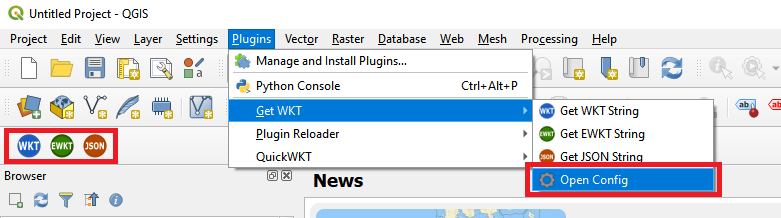
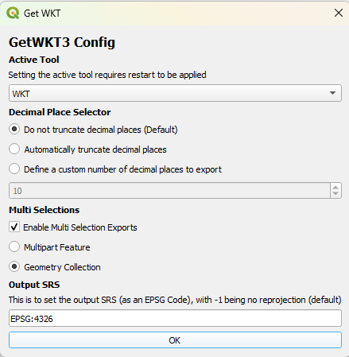

Get WKT (QGIS Plugin)
===========

QGIS plugin that allows you to view the WKT,EWKT or JSON of a geometry.

This plugin displays the selected features' WKT,EWKT or JSON representation.

The number of decimal places returned by the tool can be specified in the tools settings. The auto setting takes a guess at the number of decimal places that are appropriate based on the layers CRS.

It differs from QGIS's Core copy functionality by only extracting the features WKT, rather than the entire record. Simply select a feature, press the button and the WKT,EWKT or JSON represenation will be displayed in a dialog box where you can copy its content for use in creating or updating geometries in SQL statements.

Based on the QGIS 2.0 Plugin of the same name by Hugo Ledoux https://github.com/hugoledoux/QGIS-getWKT. Migrated to QGIS 3.0 by Paul Skeen.

# Compile (Windows)
On a system with OSGeo, open the OSGeo Shell and run build.bat in the project folder. The release will be compiled into a folder named 'getwkt'.

# Changelog
* 1.0 Initial Release (WKB Support)
* 1.1 Added support for EWKT & JSON
* 1.2 Added fix for 3.8 (Thanks imajic-unimelb https://github.com/imajic-unimelb) and support for making windows larger.
* 1.3 Added fix to align WKT using X and M values to standard, and to provide a mechanism to control the number of decimal places exported (Thanks heidivanparys https://github.com/heidivanparys #5). Minor change to build scripts and move to using plugins menu rather than vector
* 1.4 Added fix for decimal precision setting not honouring type #7

# Future Plans
Add option to surround string with ST_GEOMFROMTEXT/STGEOMFROMTEXT for use in PostGIS/MSSQL Spatial
Add option to force geometry demotion/promotion or to match source
