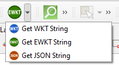
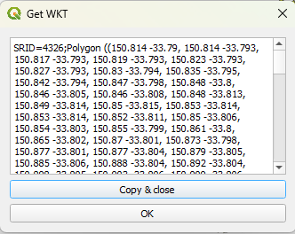
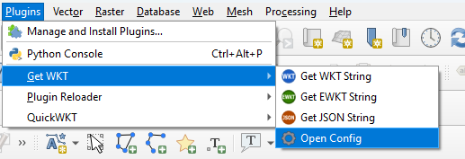

Get WKT (QGIS Plugin)
===========

QGIS plugin that allows you to view the WKT, EWKT or JSON of a geometry.

This plugin displays the selected features' WKT,EWKT or JSON representation. Copy the textual representation of your feature and paste it into other apps and api's directly.

The plugin can be configured via the 'Plugins' menu. 

The config allows users to configure the default tool selected on the Toolbar, as well as specify the number of decimal places in text exported via the tool. The auto setting takes a guess at the number of decimal places that are appropriate based on the input layers CRS.

Users can also opt to support multi geometries via either multi-types or geometry collections. The default is for only single feature selections to be supported.

The outptu CRS can now be supplied by specifying an ESPG code. The default is -1 which does not apply a transformation. This is useful if you have multiple source datasets and want to consistently move data to a single target with a specific CRS.

It differs from QGIS's Core copy functionality by only extracting the features WKT, rather than the entire record. Simply select a feature, press the button and the WKT,EWKT or JSON represenation will be displayed in a dialog box where you can copy its content for use in creating or updating geometries in SQL statements.

Based on the QGIS 2.0 Plugin of the same name by Hugo Ledoux https://github.com/hugoledoux/QGIS-getWKT. Migrated to QGIS 3.0 by Paul Skeen.

# Compile (Windows)
On a system with OSGeo, open the OSGeo Shell and run build.bat in the project folder. The release will be compiled into a folder named 'QGIS3-getWKT'.

# Changelog
* 1.0 Initial Release (WKB Support)
* 1.1 Added support for EWKT & JSON
* 1.2 Added fix for 3.8 (Thanks imajic-unimelb https://github.com/imajic-unimelb) and support for making windows larger.
* 1.3 Added fix to align WKT using X and M values to standard, and to provide a mechanism to control the number of decimal places exported (Thanks heidivanparys https://github.com/heidivanparys #5). Minor change to build scripts and move to using plugins menu rather than vector
* 1.4 Added fix for decimal precision setting not honouring type #7. Also a minor update to build process and squashed a bug not allowing an export of 0 zero decimal places.
* 1.5 Reduced default number of buttons on toolbar and allow selection of default action #9. Merged changes from piomar123 (https://github.com/piomar123 #10 #11) to add a copy button and to ensure window is on top
* 1.6 Bug Fixes
* 1.7 Added support to export to multi and geom collection types and support reprojection via config
* 
# Future Plans
* Add option to pad string with ST_GEOMFROMTEXT/STGEOMFROMTEXT for use in PostGIS/MSSQL Spatial (Unknown ETA)
* Add option for ESRI Json export