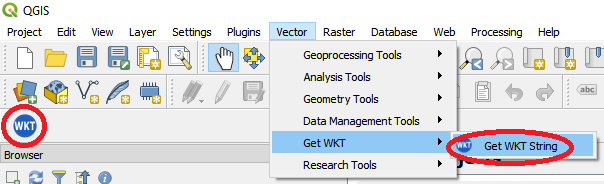

Get WKT (QGIS 3.0)
===========

QGIS plugin that allows you to view the WKT,EWKT or JSON of a geometry.

This plugin displays the selected features' WKT,EWKT or JSON representation.

It differs from QGIS's Core copy functionality by only extracting the features WKT, rather than the entire record. Simply select a feature, press the button and the WKT,EWKT or JSON represenation will be displayed in a dialog box where you can copy its content for use in creating or updating geometries in SQL statements.

Based on the QGIS 2.0 Plugin of the same name by Hugo Ledoux https://github.com/hugoledoux/QGIS-getWKT. Migrated to QGIS 3.0 by Paul Skeen.

# Compile (Windows)
On a system with OSGeo, open the OSGeo Shell and run build.bat in the project folder. The release will be compiled into a folder named 'build'.

# Changelog
  1.0 Initial Release (WKB Support)
  1.1 Added support for EWKT
      Added support for JSON

# Future Plans

Add option to surround string with ST_GEOMFROMTEXT/STGEOMFROMTEXT for use in PostGIS/MSSQL Spatial
